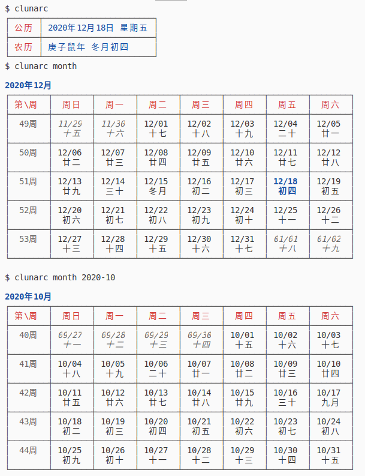

Chinese Lunar Calendar CLI
====

中国农历日历CLI工具，数据来源基于[traditional-chinese-calendar-database]

### 使用方式
通过npm安装
```shell
npm install --global clunarc
```
```shell
$ clunarc --help
Usage: clunarc [options] [command] [gregorian]

Options:
  -V, --version         output the version number
  -f --format <format>  公历日期的格式化方式 (default: "YYYY-MM-DD")
  -h, --help            display help for command

Commands:
  month [month]         按月显示
```



[traditional-chinese-calendar-database]: https://github.com/hungtcs/traditional-chinese-calendar-database
